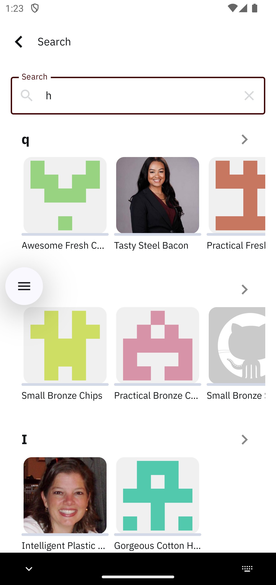

# Thmanyah Android App

<p align="center">
  
  
  
  
  
  
</p>

A modern Android application built with **Jetpack Compose**, showcasing a **clean, modular architecture**, robust state management, and dynamic UI layouts for podcast-like content.

---

## Preview

<p align="center">
  <table>
    <tr>
      <th>Home</th>
      <th>Search</th>
    </tr>
    <tr>
      <td></td>
      <td></td>
    </tr>
  </table>
</p>

---

## Features

- **Dynamic Content Display** — Podcasts, Episodes, Audiobooks, Audio Articles.
- **Modular Architecture** — Clear separation across `app`, `domain`, and `data`.
- **Debounced Search** — Efficient querying without spamming the network.
- **Adaptive Section Layouts** — Row, square items, big squares, two-line horizontal scroll.
- **Graceful Loading & Error States** — Predictable user feedback & retry flows.
- **Polymorphic JSON** — Custom Gson adapter to parse mixed item types safely.

---

## Tech Stack

- **Kotlin**, **Jetpack Compose**, **Material 3**
- **Hilt** (Dependency Injection)
- **Coroutines** & **Flow**
- **Retrofit** + **OkHttp**
- **Gson** (with custom type adapters)

---

## Architecture

Follows **Clean Architecture** with MVVM-style presentation.

```mermaid
flowchart LR
  UI[Compose UI] --> VM[ViewModel]
  VM --> Repo[Repository (Interface)]
  Repo -->|Network| API[Retrofit + Gson]